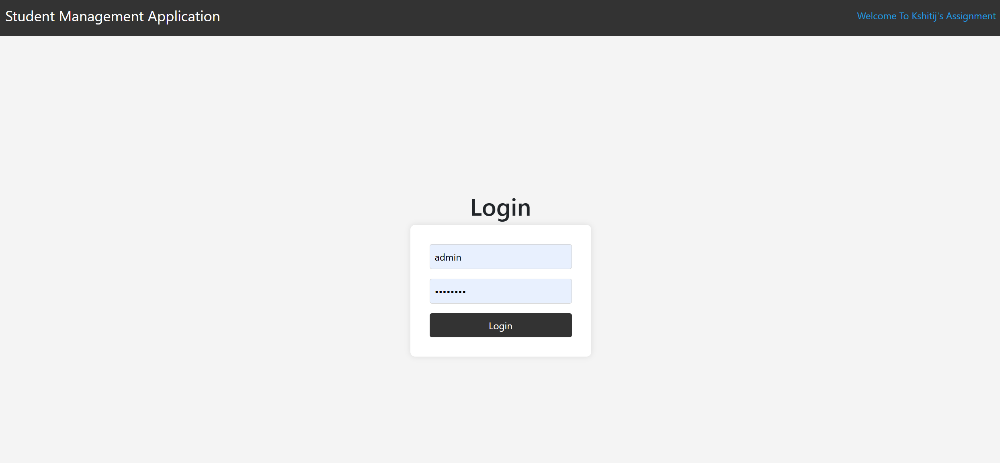
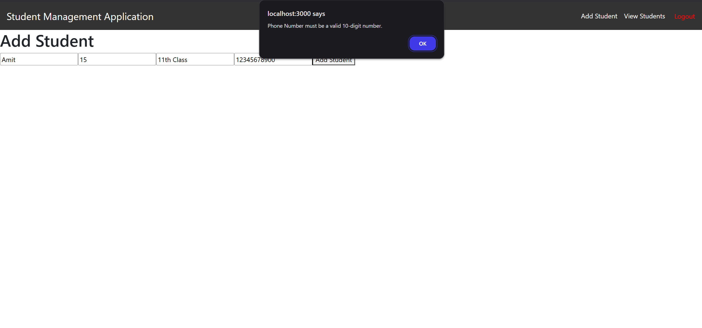
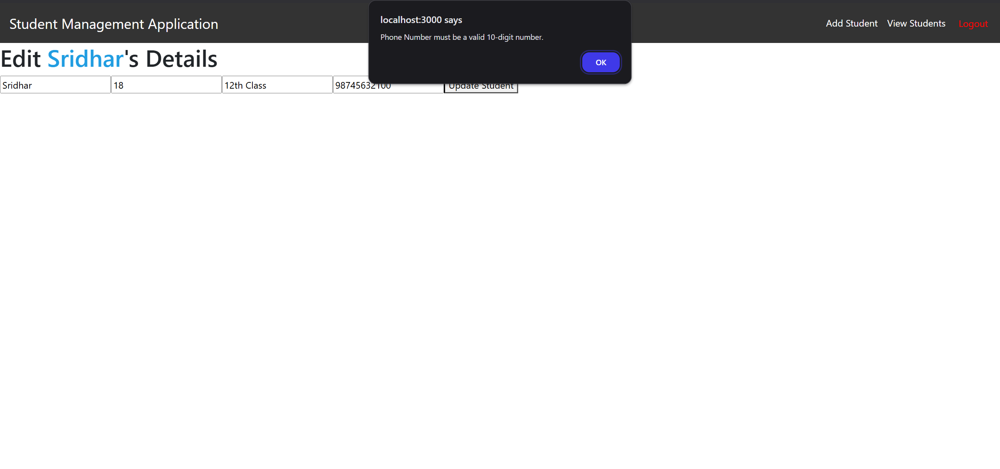
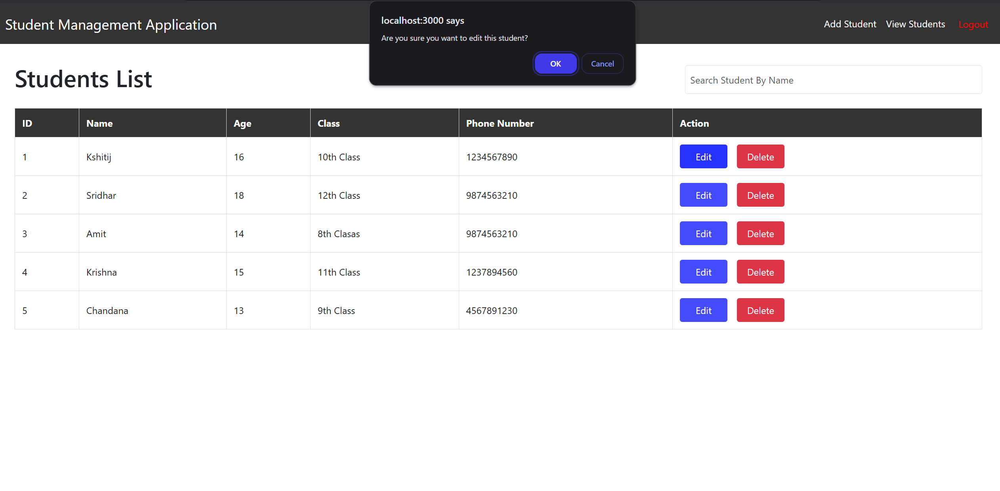
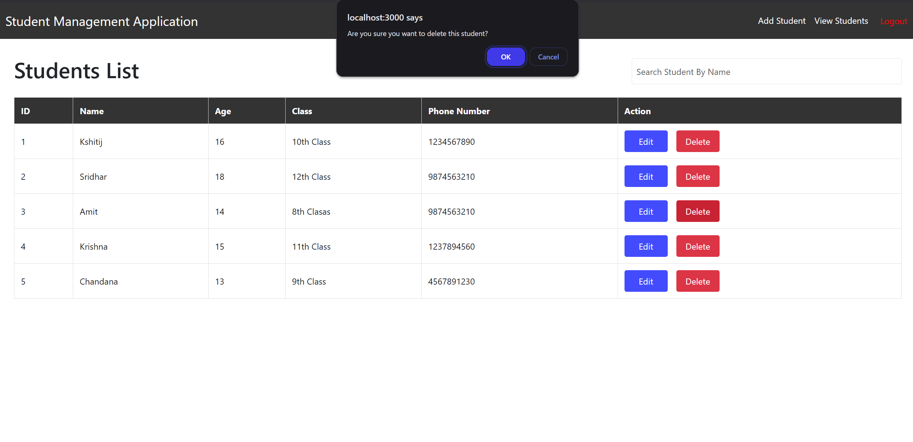
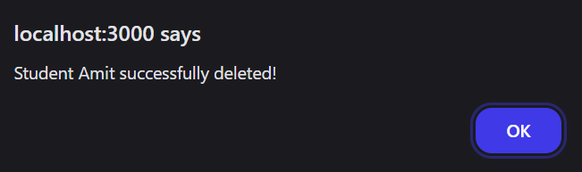
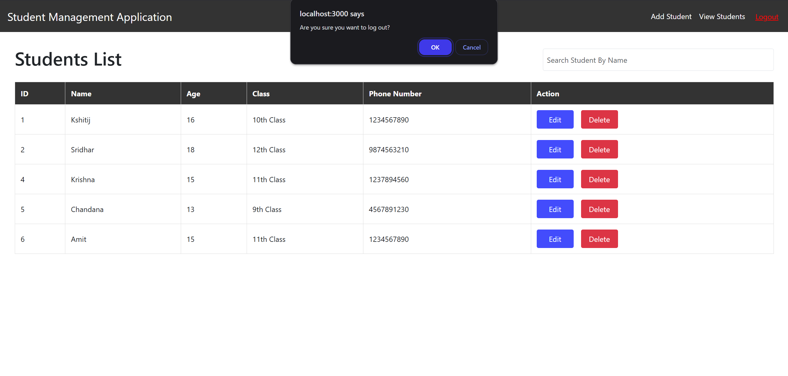
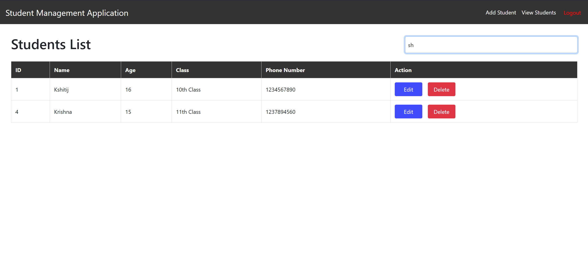

# Student Management App

A full-stack web application for managing student records. This application allows users to add, edit, view, and delete student details. It includes features like form validation, token-based authentication, and a responsive user interface.

---

## Features

- **Add Student**: Add a new student with details like name, age, class, and phone number.
- **Edit Student**: Update existing student details.
- **View Students**: View a list of all students.
- **Delete Student**: Remove a student from the list.
- **Form Validation**: Validate input fields (e.g., name, age, class, phone number) before submission.
- **Authentication**: Token-based authentication using JWT (JSON Web Tokens).
- **Responsive Design**: Works seamlessly on different screen sizes.
- **API-First Design**: The backend APIs are designed first, ensuring a clear contract between the frontend and backend.

---

## Technologies Used

### Frontend
- **React.js**: A JavaScript library for building user interfaces.
- **React Router**: For navigation between different pages.
- **Axios**: For making HTTP requests to the backend.
- **CSS**: For styling the application.

### Backend
- **Spring Boot**: A Java-based framework for building web applications.
- **Spring Security**: For securing the application and handling authentication.
- **JWT (JSON Web Tokens)**: For token-based authentication.
- **MySQL**: For storing student data.
- **Swagger**: For API documentation and testing.

### Tools
- **Maven**: For dependency management in the backend.
- **Postman**: For testing APIs.

---

## Setup Instructions

### Prerequisites

- **Node.js** and **npm** installed (for frontend).
- **Java Development Kit (JDK)** installed (for backend).
- **MySQL** installed and running.

### Steps to Run the Application

1. **Clone the Repository**:
   ```bash
   git clone https://github.com/idevkshitij/student-management-app.git
   cd student-management-app

2. **Backend Setup**:
   - Navigate to the backend directory:
     ```bash
     cd backend
     ```
   - Update the `application.properties` file with your MySQL database credentials:
     ```properties
     spring.datasource.url=jdbc:mysql://localhost:3306/studentdb
     spring.datasource.username=your-username
     spring.datasource.password=your-password
     ```
   - Run the Spring Boot application:
     ```bash
     mvn spring-boot:run
     ```

3. **Frontend Setup**:
   - Navigate to the frontend directory:
     ```bash
     cd frontend
     ```
   - Install dependencies:
     ```bash
     npm install
     ```
   - Start the development server:
     ```bash
     npm start
     ```

4. **Access the Application**:
   - Open your browser and go to `http://localhost:3000`.

---

## API Documentation

The backend APIs follow an API-First Design approach. You can explore and test the APIs using Swagger UI:

- **Swagger UI**: [http://localhost:8080/swagger-ui.html](http://localhost:8080/swagger-ui.html)

---

## Screenshots

- **Login Page**: 
- **Add Student Page with Validation**: 
- **Edit Student Page with Validation**: 
- **Edit Confirmation**: 
- **Delete Confirmation**: 
- **Delete Confirmation (Alternative)**: 
- **Logout Confirmation**: 
- **Search Functionality**: 
- **View Students Page**: 

---

## TODO List

- Add pagination for the student list.
- Add user roles (e.g., admin, user) with different permissions.
- Improve UI/UX with a modern design library (e.g., Material-UI).
- Write unit tests for both frontend and backend.
- Add a dashboard with statistics (e.g., total students, average age).

---

## Contributing

Contributions are welcome! If you'd like to contribute, please follow these steps:

1. Fork the repository.
2. Create a new branch for your feature or bugfix.
3. Commit your changes.
4. Push your branch and open a pull request.

---

## License

This project is licensed under the MIT License. See the [LICENSE](LICENSE) file for details.
